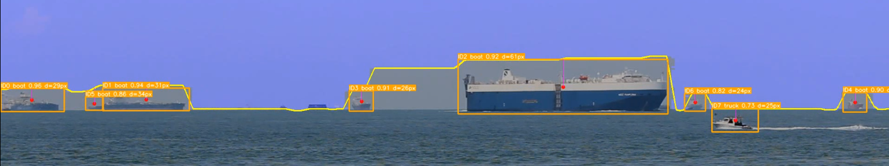
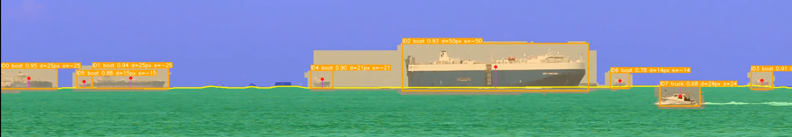
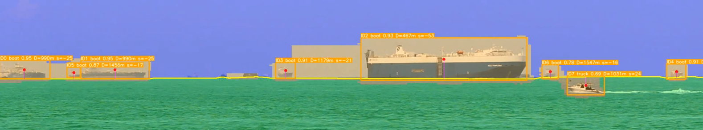

# U-Net Horizon Line & Maritime Object Segmentation (Versioned Evolution)

This folder (`3.7training_unet`) contains an ordered evolutionary track (versions 0 → 5) of experiments for horizon line segmentation and ship-aware semantic modeling in maritime scenes. Each version introduces new ideas: starting from plain 2‑class U-Net (sky / water) toward multi-class (sky / water / object) segmentation enriched by external object detectors (YOLO / RT-DETR) and distance-aware runners.

Use this README to:
1. Understand what changed in every numbered version.
2. Pick the correct training script, weights, and runner for your experiment.
3. Reproduce preprocessing, training, inference, and horizon/object distance estimation.

---
## Quick Version Index

| Version | Core Script(s) | Weights File | Classes | External Detector Usage | Key Additions |
|---------|----------------|--------------|---------|-------------------------|---------------|
| 0 | `0training_unet_on_colab_with_smd.py` | `0best_unet_smd.pth` | 2 (Sky/Water)* | None | Baseline 2-class (implicitly horizon via mask split) |
| 1 | `1training_unet_ship_aware.py` | `1best_unet_ship_aware_smd.pth` | 2 (Sky/Water with ship override) | Heuristics (in-script) | Ship-aware masking (objects carved out) |
| 2 | `2training_unet_ship_aware_yolo.py` | `2best_unet_yolo_aware_smd.pth` | 2 (Sky/Water with ship override) | YOLO (binary object carving) | Replaces heuristics with YOLO detections |
| 3 | `3training_unet_ship_aware_rtdetr.py`, `3z_unet_runner.py` | `3best_unet_rtdetr_aware_smd.pth` | 2 (Sky/Water with ship override) | RT-DETR | Higher quality ship masks via RT-DETR |
| 4 | `4training_unet_ship_aware_rtdetr_3_class.py`, runners: `4z_unet_runner_dist_calc_rtdetr_obj_det.py` & `_3_class.py` | `4best_unet_rtdetr_aware_smd_3cls.pth` | 3 (Water / Sky / Object) | RT-DETR (embedded in preprocessing + runner) | Full 3-class supervision + distance calc pipeline |
| 5 | `5training_unet_ship_aware_yolo_local.py`, runner: `5z_unet_runner_dist_calc_yolo_obj_det_3_class.py` | (Produces `best_unet_yolo_aware_smd_3cls.pth`)* | 3 (Water / Sky / Object) | YOLO local (`obj_det_havelsan.pt`) | Local (non-Colab), YOLO replacing RT-DETR, adds custom video (`havelsan.mkv`) |

*Earlier versions may internally treat mask as a 3rd (object) override during preprocessing but output only 2 logits. Version 4 formalizes explicit 3-class outputs; version 5 keeps that architecture with YOLO.

---
## Detailed Evolution

### Version 0 – Baseline U-Net (Colab, 2-Class)
Files:
- Train: `0training_unet_on_colab_with_smd.py`
- Weights: `0best_unet_smd.pth`
Highlights:
- Simple horizon segmentation: water vs sky.
- No explicit object class; objects are implicitly absorbed into water or sky.
- Google Colab style (Drive paths, possible pip installs).

### Version 1 – Ship-Aware (Heuristic Object Carving)
Files:
- Train: `1training_unet_ship_aware.py`
- Helper: `1hybrid_horizon_detector.py`
- Weights: `1best_unet_ship_aware_smd.pth`
Highlights:
- Still 2-class output (sky/water) but ship pixels are heuristically removed from influencing horizon (overridden regionally during mask building).
- Heuristics: intensity / morphology based pseudo object extraction inside a band near horizon.
- Objective: Remove bias where U-Net “bends” around vessel superstructures.

### Version 2 – Ship-Aware via YOLO (2-Class Output)
Files:
- Train: `2training_unet_ship_aware_yolo.py`
- Weights: `2best_unet_yolo_aware_smd.pth`
Highlights:
- Replaces heuristic ship detection with YOLO detector (external `.pt`).
- YOLO detections used only during preprocessing to mask out objects (still 2-class model head).
- Better object localization than heuristics → cleaner horizon supervision.

### Version 3 – Ship-Aware via RT-DETR (2-Class) + Basic Runner
Files:
- Train: `3training_unet_ship_aware_rtdetr.py`
- Runner: `3z_unet_runner.py`
- Weights: `3best_unet_rtdetr_aware_smd.pth`
Highlights:
- Uses Hugging Face RT-DETR for object detection in preprocessing.
- More stable detections under varied scales / occlusion vs YOLO (experimentally).
- Runner script: horizon extraction + overlay, basic inference pipeline for images/videos.

### Version 4 – Full 3-Class (Water / Sky / Object) with RT-DETR + Distance Calculator
Files:
- Train: `4training_unet_ship_aware_rtdetr_3_class.py`
- Runners:
  - `4z_unet_runner_dist_calc_rtdetr_obj_det.py` (2-class style but integrated detection & distance)
  - `4z_unet_runner_dist_calc_rtdetr_obj_det_3_class.py` (aligned with 3-class U-Net)
- Weights: `4best_unet_rtdetr_aware_smd_3cls.pth`
Highlights:
- Architectural change: network outputs 3 logits (explicit object channel) → model learns object boundaries directly instead of just ignoring them.
- RT-DETR used to label object pixels as class 2 during mask creation.
- Distance computation (pixel & optional physical) for objects relative to the horizon line.
- Supports band constraints, optional FOV for angular/metric conversions.

### Version 5 – Local YOLO 3-Class + Non-Colab + Custom Video Integration
Files:
- Train: `5training_unet_ship_aware_yolo_local.py`
- Runner: `5z_unet_runner_dist_calc_yolo_obj_det_3_class.py`
- Detector: `..\0data\models\obj_det_havelsan.pt`
- Added Video: `..\0data\havelsan.mkv` (ingested + horizon estimated heuristically)
Highlights:
- Removes all Google Drive / Colab assumptions; pure local paths & CUDA detection.
- Replaces RT-DETR with YOLO for both preprocessing (mask build) and runtime object distance.
- Adds horizon estimation for a custom video without ground-truth MAT (fallback Hough + heuristic search).
- Frame skipping for custom video to limit redundancy.
- Produces 3-class YOLO-aware weights (e.g., `best_unet_yolo_aware_smd_3cls.pth`).

---
## Choosing Which Version to Use

| Goal | Recommended Version |
|------|---------------------|
| Quick baseline horizon segmentation | v0 |
| Reduce horizon bending near ships (no extra class) | v2 (YOLO) or v3 (RT-DETR) |
| Explicit object segmentation + distance metrics | v4 (RT-DETR) or v5 (YOLO local) |
| Local offline inference (no HF / Drive) | v5 |
| Highest fidelity detection (if RT-DETR model strong & available) | v4 |

---
## Runners Overview

| Runner | Pairs With | Detection Backend | Output Layers | Features |
|--------|------------|-------------------|---------------|----------|
| `3z_unet_runner.py` | v3 weights | RT-DETR (preprocessed) | 2 | Basic horizon/seg overlay |
| `4z_unet_runner_dist_calc_rtdetr_obj_det.py` | v4 2-class style (transitional) | RT-DETR | 2 | Distance calc + detection overlay |
| `4z_unet_runner_dist_calc_rtdetr_obj_det_3_class.py` | v4 3-class | RT-DETR | 3 | Full 3-class + distances |
| `5z_unet_runner_dist_calc_yolo_obj_det_3_class.py` | v5 3-class | YOLO | 3 | Local YOLO + distances + custom video support |

## Sample Results

v3 runner (2-class):



v4 runner (3-class, pixel distances):



v4 runner (3-class, physical distance estimation attempt):



## Typical Workflow (v5 Example – Local YOLO 3-Class)

1. Place / verify resources under `0data/`:
	- `VIS_Onshore/Videos/*.avi`
	- `VIS_Onshore/HorizonGT/*.mat`
	- `havelsan.mkv`
	- `models/obj_det_havelsan.pt`
2. Run preprocessing + training (automated inside training script):
	```bash
	py 5training_unet_ship_aware_yolo_local.py
	```
3. After training, run inference & distance calculations:
	```bash
	py 5z_unet_runner_dist_calc_yolo_obj_det_3_class.py --video path\to\video.avi --yolo-model ..\0data\models\obj_det_havelsan.pt --prefer-yolo --yolo-conf 0.3 --band-up 160 --band-down 140 --show-horizon --save
	```
4. For physical distances add (example):
	```bash
	--camera-height-m 12 --fov-vertical 30 --refraction-k 1.3333 --distance-units m
	```

---
## Key Design Decisions

1. Ship-aware masking prevents horizon regression bias near tall masts / superstructures.
2. Transition from implicit “ignore ships” → explicit class improves generalization for downstream tasks (collision avoidance, ROI cropping).
3. External detection (YOLO / RT-DETR) only used for GT mask generation & runtime analytics; U-Net remains a pure segmenter.
4. Multi-class Dice + CE (in later versions) balances sparse object pixels vs dominant sky/water.
5. Local (v5) design removes dependency on Hugging Face / Google Drive for deployability.

---
## File Reference Cheat Sheet

| File | Purpose |
|------|---------|
| `0training_unet_on_colab_with_smd.py` | Baseline 2-class training (Colab) |
| `1training_unet_ship_aware.py` | Adds heuristic ship-aware preprocessing |
| `2training_unet_ship_aware_yolo.py` | Uses YOLO for ship mask override (still 2-class) |
| `3training_unet_ship_aware_rtdetr.py` | Switches detection to RT-DETR (2-class output) |
| `4training_unet_ship_aware_rtdetr_3_class.py` | Expands to 3-class (water/sky/object) with RT-DETR |
| `5training_unet_ship_aware_yolo_local.py` | Local 3-class YOLO preprocessing & training |
| `3z_unet_runner.py` | Early basic inference runner |
| `4z_unet_runner_dist_calc_rtdetr_obj_det.py` | Adds distance calc (2-class transitional) |
| `4z_unet_runner_dist_calc_rtdetr_obj_det_3_class.py` | 3-class RT-DETR distance runner |
| `5z_unet_runner_dist_calc_yolo_obj_det_3_class.py` | YOLO 3-class distance + detection runner |
| `*_best_unet_* .pth` | Saved model checkpoints per version |

---
## Migration Guidance

| From | To | Action |
|------|----|--------|
| v0/v1 → v2 | Want detector-driven ship masking | Add YOLO weights; rerun preprocessing |
| v2 → v3 | Evaluate RT-DETR vs YOLO | Supply RT-DETR checkpoint directory (config + weights) |
| v3 → v4 | Need explicit object class | Switch to 3-class script + regenerate dataset |
| v4 → v5 | Remove HF / run locally | Replace RT-DETR with YOLO `.pt`, add local video |

---
## Future Ideas (Not Yet Implemented)
- Temporal smoothing of horizon (Kalman / EMA across frames).
- Lightweight MobileNet / EfficientNet encoder for edge devices.
- Semi-supervised refinement of object class using entropy minimization.
- Automatic horizon estimation fallback integrated earlier in pipeline (for all non-GT videos).
- Mixed precision & gradient accumulation for larger input resolutions.